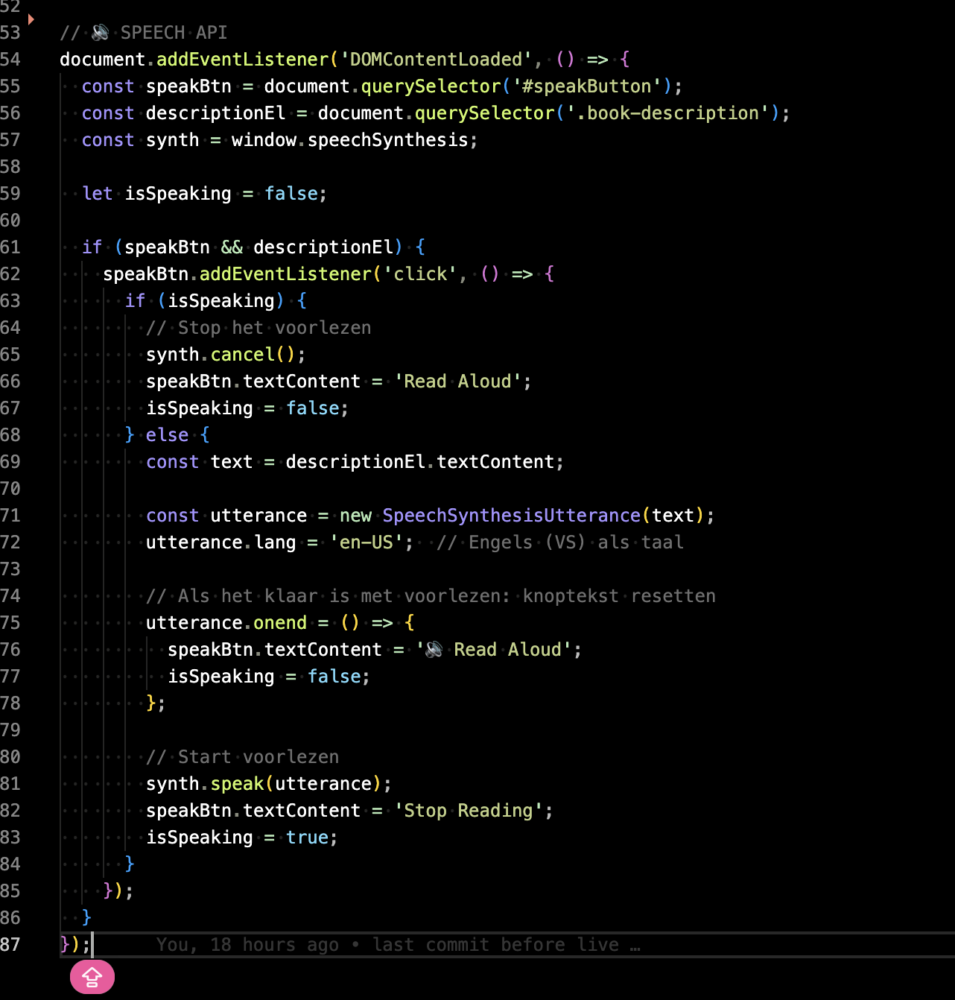

# Boeken App - Projectverslag

## Proces en Keuze van de Applicatie

In dit project heb ik een boekenapplicatie gebouwd die gebruik maakt van de Google Books API. Het idee achter deze app is ontstaan uit mijn passie voor lezen en de wens om meer inzicht te krijgen in hoe API's werken. Het afgelopen jaar heb ik mijn liefde voor boeken verder ontwikkeld, en ik vond het belangrijk om een applicatie te creëren die niet alleen functioneel is, maar ook mijn persoonlijke interesse weerspiegelt.

### Wat de App kan en doet
De app biedt de mogelijkheid om boeken te zoeken via de Google Books API, waarbij gebruikers boeken kunnen vinden en meer informatie kunnen krijgen, zoals de titel, auteur en een korte omschrijving. Gebruikers kunnen boeken toevoegen aan een favorietenlijst, die lokaal wordt opgeslagen via `localStorage`. De favorieten worden visueel weergegeven in de app als dynamische kaartjes, wat zorgt voor een overzichtelijke en gebruiksvriendelijke ervaring. 

Daarnaast maakt de applicatie gebruik van de **Speech API** om boekentitels voor te lezen wanneer een boek aan de favorietenlijst wordt toegevoegd, en de **Vibration API** voor een visuele en fysieke feedback wanneer een gebruiker interactie heeft met de app. 

### Waarom ik deze Keuze heb gemaakt
Ik heb gekozen voor het bouwen van een boekenapp omdat lezen een grote passie van mij is geworden het afgelopen jaar. De keuze voor een boekenapp die niet alleen praktische functies biedt, maar ook verschillende web-API's integreert, zorgt ervoor dat de applicatie zowel nuttig als interessant is. Het ontwikkelen van deze applicatie stelde mij in staat om mijn interesse in boeken te combineren met mijn leerproces in webdevelopment, wat voor mij de perfecte uitdaging was.

## Week 1

### Eerste idee & Oriëntatie
In week 1 begon ik enthousiast met het idee om de API van Hardcover te gebruiken voor mijn applicatie. Ik heb de hele week video's gekeken om beter te begrijpen hoe die API werkte en wat de mogelijkheden waren.

### Proces & Obstakels
Al snel merkte ik dat de Hardcover API niet heel toegankelijk was voor beginners en ook moeilijk te testen. Hierdoor kwam ik qua ontwikkeling nog niet ver. Wel leerde ik veel over hoe API's in het algemeen werken en hoe ik via JavaScript een externe API zou kunnen aanspreken.

### Voortgangsgesprek & Feedback
- Veel tijd gestoken in oriëntatie, maar Hardcover was lastig te gebruiken
- Advies: blijf onderzoek doen en kies iets werkbaars
- Tip: maak het jezelf niet te moeilijk in het begin
- Vraag gesteld: hoe pak ik het structureren van zo'n project het beste aan?
- Opdracht: begin klein en werk vanuit een basisidee verder

---

## Week 2

### Nieuwe richting
Ik heb er uiteindelijk voor gekozen om een meer toegankelijke REST API te gebruiken: de Google Books API. Deze was goed gedocumenteerd en gaf duidelijke output. Hier ben ik vervolgens mee aan de slag gegaan.

### Structuur begrijpen & eerste ontwerp
In het begin snapte ik niks van de mapstructuur van de server, client, views, etc. Ik heb tijd genomen om dit goed uit te pluizen en daarna werd het werken met de bestanden een stuk logischer. Ook is het me gelukt om een eigen CSS-bestand te koppelen en wat eerste stijlelementen toe te voegen.

Cyd gaf aan dat ik nog niet goed in beeld had wat ik nou precies ging maken. Daarom ben ik aan de slag gegaan met ontwerpen in Adobe XD. Hier zie je de schetsen 
Deze vond ik net wat te donker en Cyd ook

Dus ik ging verder met prototypen:
 

### Voortgangsgesprek & Feedback
- Canvas API en Vibration API genoemd als inspiratie
- Boekenconcept werd enthousiast ontvangen
- Belangrijkste feedback: focus op styling en gebruikerservaring
- Positieve reactie op het kiezen van een toegankelijke API
- Suggestie om features klein en behapbaar te houden
- Feedback: probeer je idee visueel te maken (XD ontwerp toegevoegd)
- Belang van consistente structuur in code benadrukt
- Tip: structuur vooraf uitdenken in plaats van zomaar beginnen
- Aandachtspunt: focus behouden op het doel van de applicatie

---

## Week 3

### Favorieten functionaliteit
Deze week ben ik aan de slag gegaan met het toevoegen van een favorietenknop. In het begin begreep ik totaal niet hoe ik dit moest aanpakken, maar met hulp van Cyd is het me gelukt. De gebruiker kan nu boeken opslaan in de favorietenlijst via een klik op een knop, en deze worden opgeslagen in localStorage.

### Visuele weergave
De favorieten worden weergegeven in een apart overzicht in de vorm van kaartjes met boekinformatie. De kaartjes worden dynamisch gegenereerd.

### Voortgangsgesprek & Feedback
- Favorieten opslaan via localStorage werkt goed
- Let op: duidelijke visuele terugkoppeling bij opslaan
- UX-tip: geef gebruikers feedback als iets gelukt is
- Tijdsplanning verbeteren, want er is nog veel te doen
- Compliment: goed zelfstandig doorgezet op complex onderdeel
- Idee van kaartjesstructuur werd gewaardeerd
- Tip: zorg voor fallback tekst/beeld bij lege favorietenlijst
- Cyd: blijf testen of favorieten consistent worden opgeslagen
- Suggestie: werk met loading states voor een betere flow

---

## Week 4

## Web API's

### 🔊 Speech API
In mijn applicatie heb ik de Web Speech API geïntegreerd om de boekbeschrijvingen voor te laten lezen. Wanneer je op de knop "🔊 Read Aloud" klikt, wordt de tekst van de beschrijving hardop voorgelezen door de browser. Dit maakt de applicatie toegankelijker én leuker om te gebruiken, vooral voor mensen die moeite hebben met lezen of gewoon liever luisteren.

De gebruiker kan op elk moment het voorlezen stoppen met dezelfde knop. Als het voorlezen klaar is, verandert de knoptekst automatisch weer terug. Ik heb gekozen voor de taal `en-US`, zodat de uitspraak van Engelse boekbeschrijvingen goed klinkt.

Het toevoegen van deze API zorgt voor een interactieve en persoonlijke ervaring, wat goed past bij mijn doel: een boekenapp maken die net zo levendig en boeiend is als het lezen zelf.

 

---

### 📳 Vibration API
Om de gebruikersinteractie tastbaarder te maken, heb ik de Vibration API toegevoegd. Telkens wanneer een gebruiker een boek toevoegt aan zijn of haar favorieten, trilt het apparaat kort (100 milliseconden). Dit gebeurt alleen als het apparaat vibratie ondersteunt.

Deze subtiele feedback zorgt ervoor dat de actie van het toevoegen van een favoriet duidelijker en bevredigender aanvoelt. Zeker op mobiele apparaten is dit een fijne toevoeging, omdat het de gebruikerservaring versterkt zonder visuele elementen te overladen.

---

Deze twee Web API's zijn voorbeelden van hoe relatief simpele technieken kunnen bijdragen aan een rijkere en persoonlijkere gebruikerservaring. Ik vond het leuk om hiermee te experimenteren en ze toe te passen in een applicatie die voortkomt uit mijn liefde voor lezen.

 

### Laatste details
Ik heb de styling van de applicatie verder afgerond, foutafhandeling toegevoegd voor lege zoekresultaten, en verschillende onderdelen getest. Daarnaast is de server voorzien van console logs die aangeven of de verschillende categorieën succesvol worden geladen.

### Voortgangsgesprek & Feedback
- Speech API als leuke extra gewaardeerd
- Vibration API voegt waarde toe aan de UX
- Positieve verrassing dat alles goed werkt in korte tijd
- Laatste tip: controleer goed op bugs en polish alles visueel
- Vraag beantwoord over deployen (niet verplicht, maar mag)
- Algemeen: mooie groei en goed eindresultaat
- Aandachtspunt: Web API's goed documenteren in Readme
- Suggestie: blijf testen op verschillende schermgroottes en browsers
- Feedback: denk na over schaalbaarheid in de toekomst
- Cyd: leuk dat je meerdere Web APIs durfde te combineren

### Reflectie
Ik ben trots dat ik in vier weken een goed werkend prototype heb weten te bouwen. Van helemaal niets weten over API's en mapstructuren, naar een dynamische boekenapplicatie met een favorietenfunctie, meerdere pagina’s en zelfs Web API’s.
